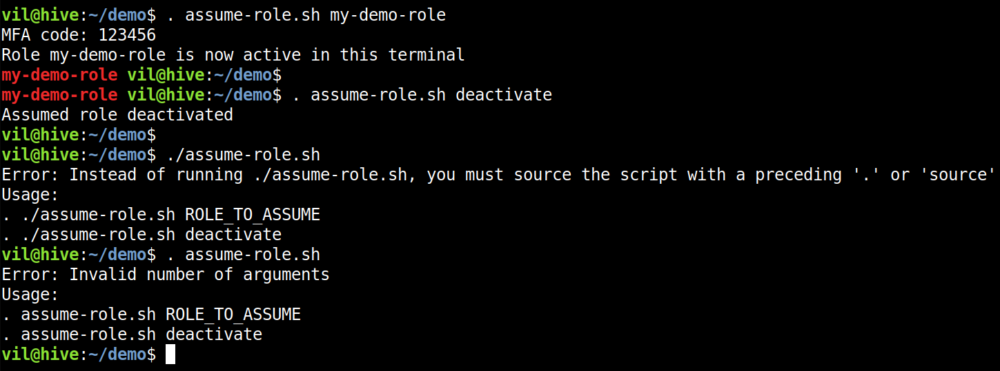

# assume-role-prompt

A simple safety wrapper that adds a visible reminder to terminal prompt for the role assumed with [assume-role](https://github.com/remind101/assume-role)

## Motivation

Adding AWS API credentials as default credentials to your terminal as environment variables is potentially dangerous when working with multiple AWS accounts. You should always use AWS credential profiles and explicitly state which profile you wish to use.

Many 3rd-party tools like [serverless](https://github.com/serverless/serverless) and [awslogs](https://github.com/jorgebastida/awslogs) may not fully support assuming a role with cross-account access. This is needed when you have a single AWS account with all the IAM users (a federation account), and several target accounts where you wish to "jump to". This becomes increasingly complex when used in conjunction with MFA.

With the assume-role, you can assume a role by setting its temporary credentials as environment variables to your terminal.

## Prerequisites

- [assume-role](https://github.com/remind101/assume-role) installed and in your PATH
- IAM credentials set in `~/.aws/config` and `~/.aws/credentials`

## Usage

To activate a role:

    . assume-role.sh my-demo-role

Now you can use your role with any AWS tools by using the default credentials profile.

To deactivate a role:

    . assume-role.sh deactivate

Screenshot:

## Limitations

The prompt is updated only when this script is run. It does not dynamically detect if you e.g. unset/overwrite the environment variables by some other means.

## The correct fix

Instead of using this script, 3rd-party tools should use assumed roles (with MFA) properly.

For more info, see:

- [serverless/serverless#3833](https://github.com/serverless/serverless/issues/3833)
- [jorgebastida/awslogs#202](https://github.com/jorgebastida/awslogs/issues/202)
- [remind101/assume-role#36](https://github.com/remind101/assume-role/issues/36)
